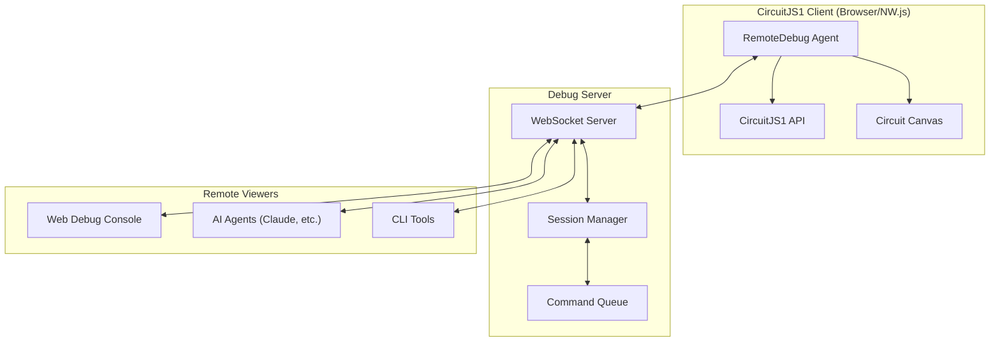

# CircuitJS1 Remote Debug System — Concept & Implementation Plan

## Overview

This document describes the concept and implementation plan for a remote debugging system for CircuitJS1, inspired by [RemoteJS](https://remotejs.com/how.html). The system enables remote control, diagnostics, and AI-assisted circuit manipulation over WebSocket connections.

### Goals

- Remote execution of JavaScript commands (console access)
- Circuit screenshots (canvas only, not entire window)
- Full circuit state export/import
- Simulation control with real-time telemetry streaming
- Remote element parameter editing
- Circuit switching and project management
- AI agent integration for automated testing and circuit optimization

---

## Architecture



### Connection Flow

1. Client loads `remote-debug-agent.js` with channel UUID
2. Agent connects to debug server via Socket.IO/WebSocket
3. Server assigns session ID and registers agent
4. Viewers connect to same channel to interact
5. Commands flow bidirectionally with JSON-RPC-like protocol

---

## Protocol Design

### Message Types

| Type | Direction | Description |
|------|-----------|-------------|
| `register` | Agent→Server | Register with channel and capabilities |
| `registered` | Server→Agent | Confirm registration, assign session ID |
| `execute` | Viewer→Agent | Execute JS command |
| `execute_result` | Agent→Viewer | Return execution result |
| `screenshot` | Viewer→Agent | Request circuit screenshot |
| `screenshot_result` | Agent→Viewer | Return base64 image |
| `telemetry` | Agent→Viewer | Streaming simulation data |
| `circuit_export` | Viewer→Agent | Request full circuit export |
| `circuit_import` | Viewer→Agent | Import circuit from JSON |
| `sim_control` | Viewer→Agent | Start/stop/step simulation |
| `element_update` | Viewer→Agent | Update element properties |

### Message Format

```typescript
interface Message {
    type: string;
    id?: string;           // Request ID for correlation
    channelId: string;     // UUID channel identifier
    payload: any;          // Type-specific data
    timestamp: number;     // Unix timestamp
}
```

---

## Core Features

### 1. Remote Console Execution

Execute arbitrary JavaScript with access to `CircuitJS1` API:

```javascript
// Request
{ type: "execute", payload: { command: "CircuitJS1.getSimInfo()" } }

// Response
{ type: "execute_result", payload: { 
    success: true,
    result: { time: 0.001234, running: true, elementCount: 15 }
}}
```

**Security considerations:**
- Optional command whitelist mode
- Execution timeout (5s default)
- Sandboxed eval context

### 2. Circuit-Only Screenshots

Unlike RemoteJS which captures the entire page, we capture only the circuit canvas:

```javascript
// Implementation approach
function captureCircuitCanvas() {
    const canvas = document.querySelector('canvas.circuitCanvas');
    return canvas.toDataURL('image/png');
}
```

For high-quality captures with element labels and annotations:

```javascript
// Use existing SVG export
const svg = CircuitJS1.getCircuitAsSVG();
```

### 3. Circuit State Export/Import

Full circuit serialization with simulation state:

```javascript
// Export with state
const fullState = {
    circuit: JSON.parse(CircuitJS1.exportAsJsonWithState()),
    simInfo: CircuitJS1.getSimInfo(),
    scopeData: getScopeDataSnapshot(), // All scope waveforms
    timestamp: Date.now()
};

// Import with state restoration
CircuitJS1.importFromJson(circuitJson);
CircuitJS1.setSimRunning(false);
// Restore initial conditions if provided
```

### 4. Real-Time Telemetry Streaming

Streaming simulation data at configurable intervals:

```javascript
// Telemetry subscription
{ type: "telemetry_subscribe", payload: {
    elements: ["R1", "C1", "V1"],     // Element IDs to monitor
    interval: 100,                     // ms between updates
    fields: ["voltage", "current", "power"]
}}

// Telemetry stream message
{ type: "telemetry", payload: {
    time: 0.00145,
    elements: {
        R1: { voltage: 4.95, current: 0.00495, power: 0.0245 },
        C1: { voltage: 3.21, current: 0.00175, power: 0.0056 },
        V1: { voltage: 5.0, current: -0.0067, power: -0.0335 }
    },
    scopes: [{ /* scope 0 min/max values */ }]
}}
```

### 5. Element Parameter Control

Remote modification of circuit elements:

```javascript
// Update single property
{ type: "element_update", payload: {
    elementId: "R1",
    property: "resistance",
    value: 2200
}}

// Batch update
{ type: "elements_update", payload: {
    updates: [
        { id: "R1", resistance: 2200 },
        { id: "C1", capacitance: 100e-6 },
        { id: "V1", voltage: 12 }
    ]
}}
```

### 6. Circuit Switching

Navigate between multiple circuits/tabs:

```javascript
// List available circuits
{ type: "circuits_list" }
{ type: "circuits_list_result", payload: { 
    circuits: [
        { id: "tab-0", name: "RC Filter", active: true },
        { id: "tab-1", name: "Oscillator", active: false }
    ]
}}

// Switch to circuit
{ type: "circuit_switch", payload: { circuitId: "tab-1" }}
```

### 7. AI Agent Integration

Special endpoints for AI-driven automation:

```javascript
// AI action request (structured command)
{ type: "ai_action", payload: {
    action: "optimize_component",
    target: "R1",
    objective: "minimize_power_dissipation",
    constraints: { voltage_drop: { min: 2, max: 5 } }
}}

// AI response with reasoning
{ type: "ai_action_result", payload: {
    success: true,
    changes: [{ elementId: "R1", property: "resistance", oldValue: 1000, newValue: 2200 }],
    reasoning: "Increased resistance to reduce current while maintaining voltage drop within constraints"
}}
```

---

## Implementation Plan

### Phase 1: Core Infrastructure (v0.1)

#### File: [NEW] `src/main/webapp/scripts/remote-debug-agent.js`
- Socket.IO client connection with auto-reconnect
- Channel UUID from `data-consolejs-channel` attribute (compatibility)
- Basic message routing
- Console log/error interception

#### File: [NEW] `server/remote-debug-server.js` (Node.js)
- Socket.IO server with session management
- Channel-based room isolation
- Web viewer interface (static HTML)
- CORS and security headers

#### File: [MODIFY] `circuitjs.html`
- Optional script inclusion via URL parameter `?remote-debug=<channel-id>`

### Phase 2: Circuit-Specific Features (v0.2)

#### File: [MODIFY] `src/main/java/com/lushprojects/circuitjs1/client/CirSim.java`
- Export `captureCanvas()` and `captureCanvasAsSVG()` to JSNI
- Add `getCircuitList()` for multi-tab support
- Add `switchCircuit(id)` method

#### File: [MODIFY] `src/main/webapp/scripts/remote-debug-agent.js`
- Implement all message handlers
- Canvas capture (PNG and SVG)
- Telemetry subscription system with efficient polling

### Phase 3: Advanced Features (v0.3)

#### File: [NEW] `src/main/webapp/scripts/remote-debug-ai.js`
- AI action protocol handlers
- Structured command parsing
- Multi-step automation support

#### File: [MODIFY] `server/remote-debug-server.js`
- Rate limiting per channel
- Optional authentication
- Persistent session storage (Redis optional)

---

## Agent Script Integration

### Minimal Integration (Compatible with RemoteJS pattern)

```html
<script 
    data-consolejs-channel="6b080461-7ee7-9a19-6c34-8f0f78b8fd92" 
    src="http://localhost:3030/agent/remote-debug-agent.js">
</script>
```

### URL Parameter Activation

```
http://localhost:8888/circuitjs.html?remote-debug=6b080461-7ee7-9a19-6c34-8f0f78b8fd92
```

### Programmatic Connection

```javascript
// In custom scripts
window.CircuitRemoteDebug.connect({
    channelId: '6b080461-7ee7-9a19-6c34-8f0f78b8fd92',
    serverUrl: 'http://localhost:3030',
    telemetryInterval: 100,
    autoConnect: true
});
```

---

## Server-Side Component

### Technology Stack

- **Runtime**: Node.js 18+
- **WebSocket**: Socket.IO v4 (fallback to polling)
- **Web UI**: Static HTML/JS viewer dashboard

### Directory Structure

```
server/
├── remote-debug-server.js    # Main server entry
├── lib/
│   ├── session-manager.js    # Channel and session tracking
│   ├── message-router.js     # Protocol message handling
│   └── telemetry-buffer.js   # Efficient telemetry aggregation
├── public/
│   ├── index.html            # Web viewer dashboard
│   ├── viewer.js             # Dashboard client logic
│   └── styles.css            # Dashboard styling
└── package.json
```

### Running the Server

```bash
cd server
npm install
npm start
# Server running on http://localhost:3030
```

---

## Web Viewer Dashboard

A browser-based debug console providing:

- **Live Console**: Execute commands, view results
- **Circuit Preview**: Real-time canvas mirroring (via periodic screenshots)
- **Telemetry Graphs**: Live plots of element values
- **Element Inspector**: Browse and edit element properties
- **Circuit Navigator**: Switch between circuits

---

## Security Considerations

> [!CAUTION]
> Remote debugging exposes full JavaScript execution access. Use only in trusted environments.

### Mitigations

1. **Channel ID as authentication**: Long random UUID
2. **Command whitelist**: Optional restriction to safe API calls only
3. **Network isolation**: Run server on localhost only by default
4. **Execution timeout**: Prevent infinite loops
5. **No production deployment** recommendation without auth layer

---

## Comparison with Chrome DevTools MCP

| Feature | Remote Debug System | Chrome DevTools MCP |
|---------|---------------------|---------------------|
| Setup complexity | Low (script include) | Medium (MCP server) |
| Works in NW.js | ✅ Yes | ❌ No |
| Works in standard browser | ✅ Yes | ✅ Yes |
| Circuit-specific features | ✅ Built-in | ❌ Manual coding |
| Real-time telemetry | ✅ Streaming | ❌ Polling |
| AI integration hooks | ✅ Designed for AI | ✅ Generic |
| Mobile/embedded access | ✅ Yes | ❌ No |

---

## Use Cases

### 1. Interactive Remote Debugging
Debug circuits running on remote/embedded devices where local DevTools are unavailable.

### 2. AI-Assisted Circuit Optimization
Let AI agents explore parameter space, run simulations, and suggest improvements.

### 3. Automated Testing
Script circuit test suites that run across different browsers/environments.

### 4. Educational Live Demos
Share live circuit demonstrations where viewers can see real-time state.

### 5. Collaborative Debugging
Multiple engineers investigate the same circuit session simultaneously.

---

## Next Steps

1. **Review and approve** this concept document
2. Implement Phase 1 core infrastructure
3. Create standalone Node.js debug server
4. Integrate agent script with CircuitJS1
5. Build web viewer dashboard
6. Test AI agent workflow integration

---

## References

- [RemoteJS Documentation](https://remotejs.com/how.html)
- [CircuitJS1 JavaScript API](file:///home/yavfast/Projects/My_projects/Circuit/circuitjs1_desktop/docs/JS_API.md)
- [Socket.IO Documentation](https://socket.io/docs/v4/)
- [html2canvas](https://html2canvas.hertzen.com/) (used by RemoteJS for screenshots)
